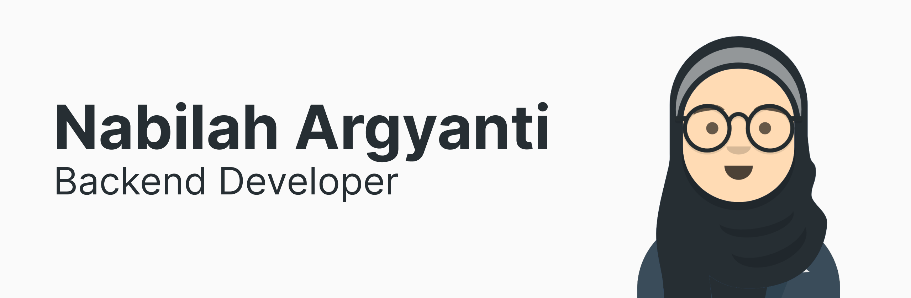

# Hi there! I'm Nabilah Argyanti 👋

  
  
  

## About Me

I'm passionate about learning and exploring various aspects of web development. My main focus is on backend work, but I also enjoy diving into frontend development, mobile apps, and even exploring data analysis.

## Tech Stack

Here are some technologies I work with:

     

## GitHub Stats

